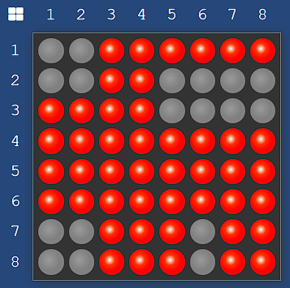
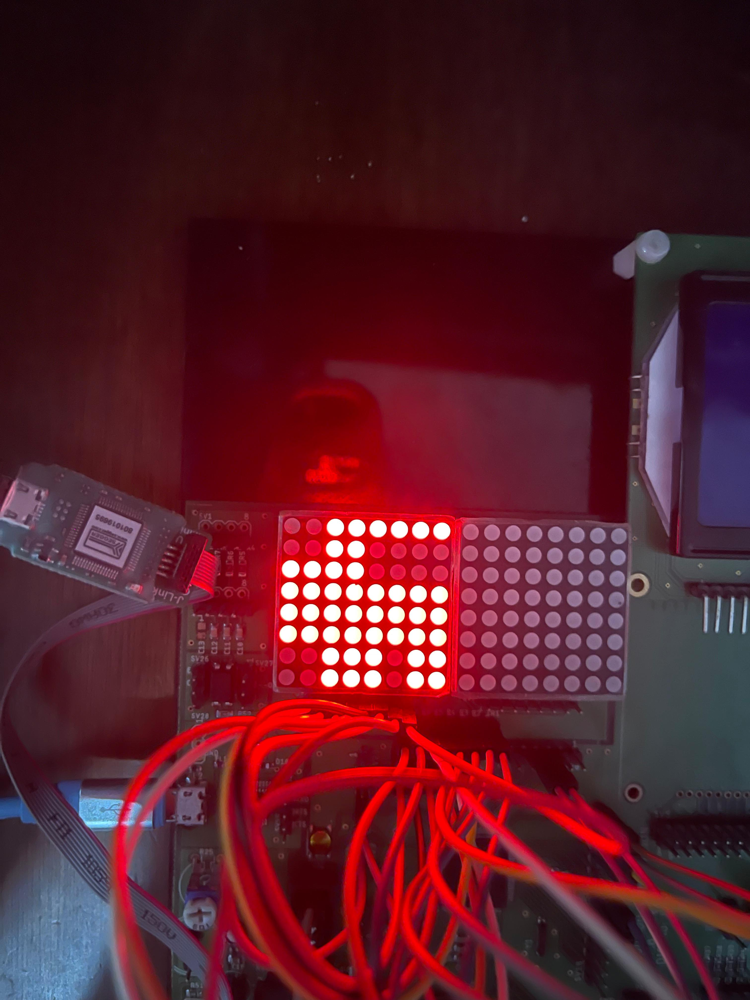
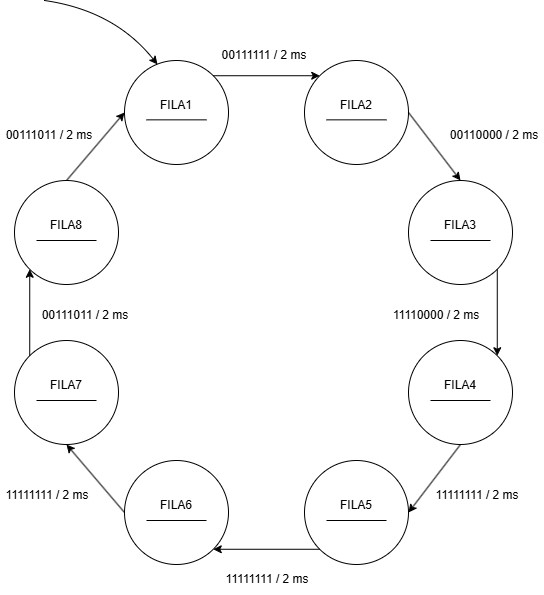
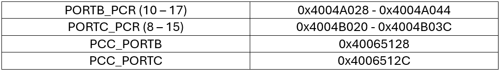

# Unidad 2
## Documentación del Proyecto
 
Nombre del estudiante: Jerónimo Quintero Chavarría  
ID: 000492388

---
## Actividad 1 - Copiar datos a memoria

En esta actividad se realizaron 5 ejercicios en los que se profundiza sobre los conceptos de tablas y vectores, así como la copia de datos desde una dirección de memoria a otra utilizando el lenguaje *Assembler*.

### Ejercicio 1

En el primer ejercicio se pide modificar un código para que los datos se copien a partir de la dirección 0x20000800. Además, se pide poner la dirección base como una constante simbólica y que los datos que se guarden sean a partir del número 50 y se incremente de 10 en 10 hasta el 140. La solución a este ejercicio se muestra a continuación:

~~~x86asm
.syntax unified
.global _start
.text

.equ direccion_base, 0x20000800

.text
.thumb_func
_start:
    bl  guardar_datos
    bx  lr

guardar_datos:
    ldr   r4, =direccion_base
    mov   r0, #50          // Inicializa el primer número a guardar
    mov   r1, #140         // Último número a guardar
loop_guardar:
    str   r0, [r4], #4     // Guarda el número en la memoria y avanza a la siguiente posición
    adds  r0, #10          // Incrementa el número en 10 para el siguiente ciclo
    cmp   r0, r1           // Compara si se ha alcanzado el último número
    ble   loop_guardar     // Si no se ha alcanzado el último número, continuar guardando
    bx    lr               // Retorna
~~~

### Ejercicio 2

En el segundo ejercicio se pide simplificar las líneas de código del programa, así como comentar que hace cada línea.

La función init que se presentaba en el código original era esencialmente inútil, pues los registros r0 y r1 serían modificados mediante un comando __mov__, por lo que se optó por eliminar la subrutina. Otro cambio que se realizó fue definir la dirección base como un .equ para una mayor legibilidad del código. Finalmente se modificó el contador de la subrutina __loop_copia__, pues no estaba funcionando correctamente.

~~~x86asm
.syntax unified
.global _start
.text

.equ direccion_base, 0x20000000  //Defino la dirección como un .equ

.thumb_func
_start:
    bl  cargar_memoria   // Toda la función init es inutil
loop:
    bl  copiar_datos
    b   .

cargar_memoria:
    ldr   r4, =direccion_base   
    mov   r0, #1             // No sirve de nada inicializar el registro r0 en 0
    mov   r1, #10
loop_carga:
    str   r0, [r4], #4
    adds  r1, #-1
    beq   fin_carga
    b     loop_carga
fin_carga:
    bx    lr

copiar_datos:
    ldr   r4, =direccion_base   
    mov   r1, #10
loop_copia:
    ldr   r0, [r4]
    cmp   r1, #0
    beq   fin_copia
    str   r0, [r4, #0x100]
    add   r4, #4
    add   r1, #-1                   // Cambio el contador
    b     loop_copia
fin_copia:
    bx    lr
~~~

### Ejercicio 3

Se pide crear el diseño de una imagen, ícono o similar, usando una tabla de 8x8 o de 16x8. Además, se pide crear una tabla usando binarios y almacenarla en forma de matriz.
La imagen que se diseño es idéntica a la que su utilizó para la implementación del trabajo final de esta unidad y que se muestra más adelante.

    

El código que cumple con el objetivo de este ejercicio es el siguiente.

~~~x86asm
.syntax unified
.global _start
.text

.thumb_func
_start:
    bl  crear_tabla_leds
    bx  lr

crear_tabla_leds:
    ldr   r4, =#0x20000000 // Dirección inicial de memoria para guardar la tabla
    ldr   r1, =leds        // Dirección de la tabla en la memoria de programa
    mov   r2, #8           // Tamaño de la matriz (filas)
    mov   r3, #8           // Tamaño de la matriz (columnas)
loop_filas:
    ldrb  r0, [r1], #1     // Carga el byte actual de la tabla de LED
    strb  r0, [r4], #1     // Guarda el byte en la dirección de memoria y avanza
    subs  r3, r3, #1       // Decrementa el contador de columnas
    bne   loop_filas       // Continúa el bucle si no se han procesado todas las columnas
    mov   r3, #8           // Reinicia el contador de columnas para la siguiente fila
    subs  r2, r2, #1       // Decrementa el contador de filas
    bne   loop_filas       // Continúa el bucle si no se han procesado todas las filas
    bx    lr               // Retorna

.section .rodata
leds:
    .byte 0b00111111 // Representación de la primera fila de LEDs
    .byte 0b00110000 // Representación de la segunda fila de LEDs
    .byte 0b11110000 // Representación de la tercera fila de LEDs
    .byte 0b11111111 // Representación de la cuarta fila de LEDs
    .byte 0b11111111 // Representación de la quinta fila de LEDs
    .byte 0b11111111 // Representación de la sexta fila de LEDs
    .byte 0b00111011 // Representación de la séptima fila de LEDs
    .byte 0b00111011 // Representación de la octava fila de LEDs
~~~

### Ejercicio 4

En el cuarto ejercicio se pide describir que es lo que hace el siguiente código:

~~~x86asm
.syntax unified
.global _start
.text

.equ v1, 0x20000100
.equ v2, 0x20000140
.equ vRes, 0x20000200

// Definición de los datos de entrada (vectores)
lista1:
.hword 1,2,3,4,0

lista2:
.hword 2,3,4,5,0

.thumb_func
_start:
    bl    init      
    bl    vector1  
    bl    vector2   
loop:
    bl    mult_vect  
    b     loop       

// Función de inicialización
init:
  // Retorna, no hace nada
  bx    lr

vector1:
  push  {lr}
  ldr   r4, =#lista1
  ldr   r5, =#v1
  bl    loop_store
  pop   {pc}

vector2:
  push  {lr}
  ldr   r4, =#lista2
  ldr   r5, =#v2
  bl    loop_store
  pop   {pc}

loop_store:
  ldrh  r0, [r4], #2
  cmp   r0, #0
  beq   end_store
  strh  r0, [r5], #2
  b     loop_store
end_store:
  // Retorna
  bx    lr

mult_vect:
  ldr   r4, =#v1
  ldr   r5, =#v2
  ldr   r6, =#vRes
  b     loop_mult

loop_mult:
  ldrh  r0, [r4], #2
  ldrh  r1, [r5], #2
  cmp   r0, #0
  beq   end_mult
  cmp   r1, #0
  beq   end_mult
  mul   r0, r1
  str   r0, [r6], #4
  b     loop_mult
end_mult:
  // Retorna
  bx    lr
~~~

Este programa realiza la multiplicación de dos vectores de enteros y almacena el resultado en un tercer vector. En resumen, este programa carga dos listas (__lista1__, __lista2__) en dos vectores (__v1__, __v2__), multiplica cada par de elementos correspondientes mediante la subrutina __loop_mult__ y almacena el resultado en un tercer vector llamado __vRes__.

### Ejercicio 5

En el quinto ejercicio se pide determinar el tipo de matriz que se tiene en el microprocesador utilizado durante el curso.

En este caso, la matriz 8x8 con la que se cuenta posee una configuración de cátodo común, es decir al suministrar una tensión en toda una columna, se debe de apagar toda una fila si se quiere encender un LED en concreto. Esto se tendrá en cuenta más adelante al desarrollar el proyecto final de la unidad.

## Actividad 2: Implementación FSM - Semáforo

En esta actividad se implementa la máquina de estados de un semáforo. Los objetivos de esta actividad son los siguientes:

- Comentar cada línea del código
- Corregir el funcionamiento del código
- Describir cuales fueron los cambios realizados

El código comentado se puede encontrar en el directorio __FSM_Semaforo__ de este mismo repositorio. Se puede verificar que el código funciona correctamente según las especificaciones de diseño: tiempo de cada estado, así como el encendido y apagado de cada led correspondiente.

Existian dos problemas en el código original que impedian su óptimo funcionamiento.

- **Tiempo de cada estado:** El tiempo que había en cada estado era el tiempo indicado por el nombre de la subrutina, por ejemplo, en _estado_rojo_ el tiempo que debía de transcurrir antes de proporcionar las salidas era _TIEMPO_ROJO_ cuando debería de haber sido _TIEMPO_AMARILLO_. Esto es así debido a que las salidas que estan ocurriendo antes de que el contador supere el _TIEMPO_ROJO_, son en realidad las salidas del _estado_amarillo_.
- **Uso de los registros PCOR y PSOR:** Los LEDs encendidos y apagados estaban puestos de forma aleatoria, por lo que en cada estado se debian definir los LEDs que se querían encender cargando un "1" en el bit correspondiente del registro PCOR, además de un "1" en el bit correspondiente del registro PSOR para los LEDs que se querían apagar.

## Actividad 3: Matriz de LEDs

Para el trabajo final de esta unidad se diseño una imagen 8x8 que se representa mediante una matriz de LEDs en el módulo de microelectrónica que se tiene. Esto se ve de la siguiente manera

    

---

### Diagrama de máquina de estados

La máquina de estados diseñada para este programa consiste en una máquina de Mealy, puesto que las salidas ocurren luego de que ocurra el estado y se de un input (tiempo). El diagrama de la máquina de estados es el siguiente:

    

Las direcciones usadas para los puertos B y C están consignadas en la siguiente tabla:

    

Falta aún por mostrar la tabla que representa la estrategia de definición de la máquina de estados, y que se ve de la misma manera que la tabla construida para la implementación de la máquina de estados del semáforo.

    

Hay que considerar que se deben hacer varias modificaciones a esta tabla, tales como los estados, añadir los registros PSOR y PCOR del puerto C, además de definir un elemento llamado __salida__ que no es más que una dirección de memoria en el que se cargarán los bits de salida, es decir, cada byte del .rodata _leds_, y que luego serán enviados a los registros PCOR y PSOR de cada puerto para poder mostrarlos en el módulo.

---

### Funcionamiento del código

El código de este programa se encuentra en el directorio __FSM_Matriz__ que se encuentra en este mismo repositorio.

Tal como se habia mencionado anteriormente, la matriz de LEDs con la que se cuenta posee una configuración de cátodo común. Se optó por utilizar una estrategia de _estados=filas_, es decir, cada fila representa el estado de la máquina. Esto implica que se debe de poner en "0" cada fila, es decir, mover un "1" al registro PCOR para poder habilitar la fila. Las columnas se habilitan con un "1", por tanto se debe de enviar un "1" al registro PSOR para poder habilitar cada columna.

La estrategia es la siguiente: habilitar cada fila, y luego habilitar todas los columnas que se necesiten encendidas y apagar el resto, luego de esperar un tiempo de transición, se pasa al siguiente estado y se hace el mismo proceso.

El puerto B fue utilizado para representar las columnas, se usaron desde los puertos B10 hasta el B17, donde el puerto PTB17 representa la primera columna y el PTB10 representa la última columna.

El puerto C fue utilizado para representar las filas, se usaron los puertos C8-C15, donde el puerto PTC8 representa la primera fila y el PTC15 representa la última fila.

La inicialización de los puertos se hizo de la misma manera que la máquina de estados del semáforo, por lo que no se ahondara en ese tema.

La lógica de cada estado es la siguiente: una vez se supera el tiempo de transición, las salidas serán enviadas a traves de los registros PCOR, PSOR y PDOR hacia el microprocesador. 

En el registro PDOR del puerto B se cargará todo el byte correspondiente al estado del mapa de LEDs, es decir que si está ocurriendo el primer estado (fila1), entonces se cargará el primer byte y se avanzará a la siguiente posición (segundo byte). 

Por otro lado, en el registro PSOR del puerto C se cargará un "1" justo en la posición del estado que se quiera apagar, si el estado es por ejemplo _fila2_, entonces se cargará un "1" en la posición de _fila1_ en el PSOR para poder apagarla, de manera análoga, en el registro PCOR se cargará un "1" para indicar la fila que se quiere encender en ese estado.

De esta manera, se están apagando y enciendo las filas dependiendo el estado que esté ocurriendo y se estan encendiendo las columnas usando los bits del mapa de LEDs, lo que significa que se está implementando correctamente la técnica de multiplexación cuyo aprendizaje es uno de los objetivos primordiales de esta unidad.